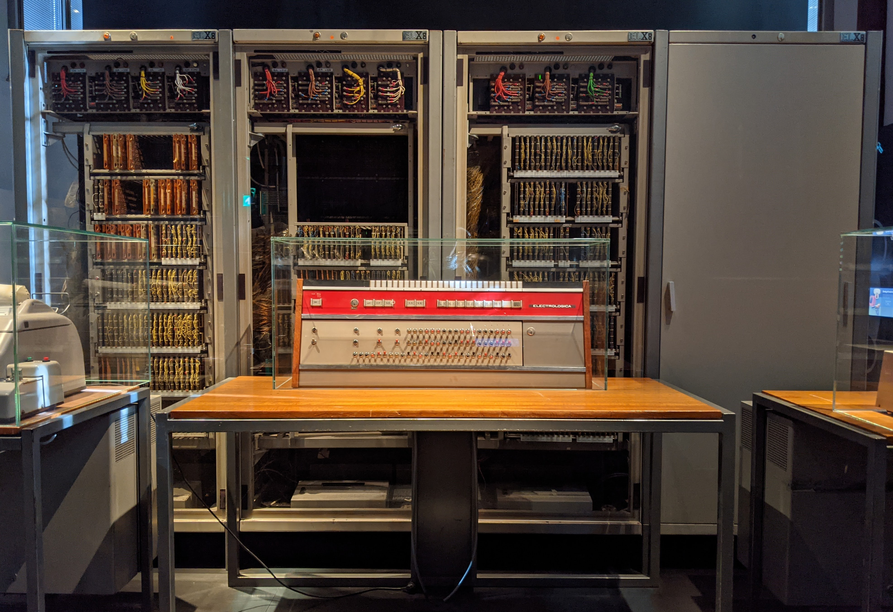

<!-- _class: lead -->

# A Cross-Platform Reimplementation of Gottfried Michael Koenig’s *Project 2*

### Casper Schipper and Luc Döbereiner

Workshop

---

# Workshop Overview

- Historical context and artistic motivations
- What PR2 is: From structure to variants
- How PR2 thinks: parameters, lists, tables, ensembles, selection principles
- What we reimplemented, decisions and design
- Hands-on work with complete structure formulas
- Future of the project

---

# PR2

*Project 2* is a computer-assisted composition program for calculating **musical structure variants** from composer-defined rules and data.

  
<strong>Composer</strong>defines rules, data, and parameter order

  
→

  
<strong>Program</strong>calculates one or more variants

  
→

  
<strong>Composer</strong>evaluates the musical consequences

---

# Not a composing machine

> “the computer does not ‘compose’; it merely carries out the orders which it is given.”

The computer performs a mechanical task that would otherwise be slow, repetitive, or practically impossible for the composer.

Koenig, Project 2, Electronic Music Reports 3, Introduction.

---

# The aim: a general compositional tool

> “There ought … to be programmes which any composer can use just as he uses manuscript paper, a piano or a tape-recorder.”

PR2 is not only a historical program; it is a proposal for a compositional medium.

Koenig, Project 2, Preface.

---

# PR2 shifts the composer’s task

> “the user of PR-2 is a designer who defines both the data base and the procedures brought to bear on it.”

PR2 is less about asking the computer to invent a piece, and more about designing a situation in which musical consequences can appear.

Otto Laske, “Composition Theory in Koenig’s Project One and Project Two,” 1981.

---

# Artistic motivation: rules as discovery

> “given the rules, find the music”

PR2 reverses a familiar analytical relation. Instead of deriving rules from a finished piece, the composer formulates rules and explores the music they make possible.

Koenig, quoted in Berg, “Composing Sound Structures with Rules,” 2009.

---

# Artistic motivation: material is already formal

> “Material was held to be the substratum of every artistic endeavour; artistic endeavour seemed impossible without a precise definition of the material.”

For Koenig, “material” is not only sound. It also includes procedures, tables, rules, and ways of combining parameters.

Koenig, “Genesis of Form in Technically Conditioned Environments,” 1987.

---

# Artistic motivation: form as process

> “I experience form as a process … every bar on paper, every sound on tape changes its formal function …”

This is close to the attitude PR2 encourages: form is not simply imposed from above, but discovered through operations on material.

Koenig, “Genesis of Form in Technically Conditioned Environments,” 1987.

---

# Variants

PR2 makes it possible to define a structural problem and generate related solutions.

  
<strong>Structure formula</strong>rules + elements + parameter hierarchy

  
→

  
<strong>Variant 1</strong>one realization

  
<strong>Variant 2</strong>another realization

  
<strong>Variant 3</strong>another realization

The compositional object is not only a score, but a field of related possibilities.

---

# Related material variants

> “This enables the composer … to design the work on the basis of related material variants.”

A variant group is not just a set of alternatives. It is a way of composing with a defined space of possibilities.

Koenig, “Layers and Variants,” 1997.

---

# Basic vocabulary

### Rules
Selection, permutation, dependency, hierarchy, grouping.

### Data / elements
Durations, dynamics, instruments, pitch materials, articulations.

### Parameters
Musical dimensions through which events are specified.

A **structure formula** is the specific combination of rules and elements for several parameters.

---

# Important PR2 parameters

- Instrument
- Harmony / pitch
- Register
- Entry delay

- Duration
- Rest
- Dynamics
- Mode of performance / articulation

The parameters are not independent: once one parameter has been composed, later parameters adapt to it according to the composer’s hierarchy.

---

# List, Table, Ensemble

  
<strong>LIST</strong>available values for one parameter

  
→

  
<strong>TABLE</strong>composer-made groupings of list values

  
→

  
<strong>ENSEMBLE</strong>selected groups available to a selection principle

  
→

  
<strong>SCORE</strong>chosen values placed into the structure

---

# Selection principles

PR2 offers several ways to choose values or groups:

- **ALEA** — random choice
- **SERIES** — random choice with repetition check
- **RATIO** — weighted choice

- **GROUP** — repeated values / group formation
- **SEQUENCE** — user-defined order
- **TENDENCY** — changing boundaries / mask

---

# Hierarchy: why order matters

PR2 calculates parameters one after another.

  
<strong>Main parameter</strong>gets priority

  
→

  
<strong>Later parameters</strong>must adapt

  
→

  
<strong>Formal result</strong>depends on the order

Example dependency pairs include pitch/register and entry delay/duration.

---

# Layers: from serial sequence to polyphonic structure

Koenig’s layer concept moves from one-dimensional sequence toward simultaneous structures.

- PR1: one main layer, later interpretable polyphonically
- PR2: multiple layers as part of the model
- Layers can share duration and tempo while carrying different parameter materials

---

<!-- _class: lead -->

# Implementing Project 2

---

## Command line versions

* Koenig's original (~1966) on an Electrologica X1/X8.

---

It had a terminal interface by answering a series of questions (over 60).

There were separate programs for each step, all reading and writing to disk (memory being limited).

This made experimenting through various variants difficult, as you could not quickly switch a parameter and rerender.

---

Atari Version (1990, Ramon Gonzalez-Arroyo & Koenig)

* Based on the manual, the Atari version was very similar to the first version, with some minor differences.

---

## GUI versions

* Koenig's Visual Studio version with GUI (late 1990's? not released)
* ? supercollider implementation ?
* Luc's version (2010, Ocaml + JAVA GUI, in testing stage)
* Python (2020, Brito & Gunnarsson)

---

<!-- _class: lead -->

# Our starting point

Bjarni Gunnarsson’s 2020 Research Catalogue project described a modern implementation effort based on recent specifications by Koenig and Koenig’s input.

We take over from Bjarni and Darien’s work as a practical and conceptual starting point for a new cross-platform reimplementation.

<https://www.researchcatalogue.net/view/1081939/1081944>

---

* First attempt was to finish the python version, but although the code was of high quality, it was difficult to get into.

---

## New Approach

* We split the program into an "engine" and a "gui" (following the attempt of 2010)
* We started with the engine first
* No series of questions, but an input defined as a "structure formula"

---

## Engine

* Written in OCaml
* We started with only two parameters, instrument and entrydelay beginning to end.
* List - Table - Ensemble, selection principles

---

The S-Expression is the simplest representation of a PR2 program

---

## Challenges with making a GUI for PR2

* There is a lot of input required
* Many inputs in pr2 are "entangled"
* Generic words like "union", "combination" & "group" have specific usages within pr2, and when combined may have different consequences.

---

I was worried at some point wether hierarchy actually meant that it was very difficult to get any output at all.

---

* In Pr2, values are often refered to by index (in table, ensemble)
* In this GUI, we show the index and the value it refers to

---

* The user should be informed but not overwhelmed
* Warnings should appear where they matter
* The shape of inputs should reflect the values that are "correct" for them, reduce "string obsession"
* "make impossible states impossible"

---

* Short feedback mechanisms for learning and experiment
* If a values causes problems inform the user immediately
* Generic terms are labeled with what they actually mean

---

## Our Tauri GUI

When the engine was done, we started to generate a GUI based on the structure formula (using our principles).

---

## Some choices we made along the way

* The GUI provides a lot of hints when the users enters values
* The documentation is closely integrated in the GUI.

---

* We intentionally left out the option to randomize the selection principles themselves (for now..)
* Optional elements in the GUI appear only when relevant
* Some parameter lists are derived from the instrument parameter (as it make no sense to have values that cannot be performed by any instrument)

---

* We added a arrow graph visualisation of interval method
* You can name instrument groups to track them better in different parameters

---

# Observations while working on PR2, what makes PR2 different?

* Although the order of values is highly automated in PR2, the actual values of parameters are provided by the composer as a list and never modified, the program permutates orders and layers. This seems important, for example, in harmony, there is a way to forbid certain pitches from ever occuring anywhere.

---

* Tendency masks in PR2 do not act on continuous ranges, they are moving boundaries over the formed ensemble. Therefore the name "mask".

----

* PR2 is an instrumental program: it thinks of music as instruments playing notes. 

----

It has some extra possibilities as well though:

  * Non standard (/= 12) octave divisions
  * Any performance techniques defined to the composer
  * Percussion (specifically as non-pitched) instruments
  * Arbitrary durations and metres, things may not line up to any quantization unless you force it to. (This also makes generating readable scores difficult).

---

* RATIO is not a weighted choice, but may better be understood as a series with repetitions int its seed-row. Also: the weights of RATIO always refer to the full list not the ensemble.

* Serial thinking is very present, however Pr2 also has generators that are the exact opposite (forced repetition, series with repeated elements, or even hand-composed sequences). 

---

* It has some Combination and Union concepts which are unique to PR2 and allow the composer to have multiple groups of material.
It allows a composer to construct vertical relationships. For example a group of durations and dynamics that may only occur together in one voice and not in the others.

---

> In my understanding, one of the
> most important decision the user has make is whether the instrument will be the last
> (or one of the last) or the first parameter. When the instrument parameter is last in
> the hierarchy (and provided there are a variety of differently defined instruments and
> possible parameter values given), the program has to find an instrument that matches all
> the constraints set by the chosen values. In other words, the program is orchestrating a
> given structure. If it is the case that the instrument is the first element in the hierarchy,
> the choice of instrument precedes and conditions all subsequent selections. In that case,
> the orchestration is given and the rest of the structure has to follow its possibilities2.
> There are of course other parameters which depend on each other such as register and
> harmony or entry delay and duration.

<https://sonology.org/wp-content/uploads/2019/10/Doebereiner-Model-and-Material.pdf>

---

